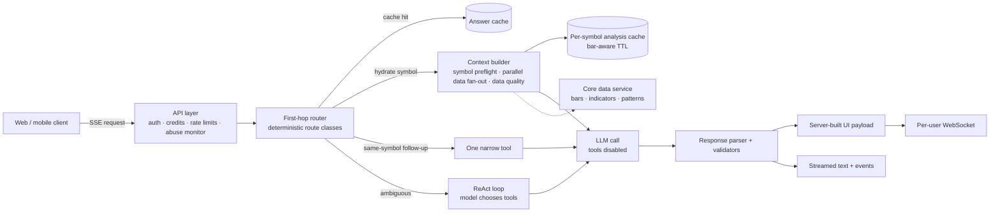

# HOZ Architecture

HOZ is the analysis agent behind TradingAssist. A retail trader types a question about a ticker and gets back a scored, plain-language read of the chart, a structured right-hand panel built from the underlying data, and a hard line that the decision to trade is theirs. This document explains how the system is put together, why it is split the way it is, and what I changed after watching it run in production.

## The problem

The decision loop being automated is the one a discretionary trader runs by hand before the open and during the session: pull the current quote and the broader market context, check indicators across several timeframes, look for a setup and an invalidation level, and decide whether the picture is worth acting on. Done manually that takes minutes per symbol and depends on the trader remembering to check everything. Done by an LLM alone it is fast but untrustworthy, because the model will happily produce a confident read from stale bars, or invent a support level when the data feed returned nothing.

What made it hard was everything around the reasoning. Market data has freshness that changes by session, symbols can be supported but not yet hydrated, one analysis fans out to a dozen upstream calls, and the same question asked twice in a minute should not cost two full analyses. The output has to be numerically grounded, safe to show a regulator, and rendered as UI rather than prose. The product runs on tiered subscriptions with a public guest surface, so cost per question and abuse resistance are architectural constraints. The engineering is in making one LLM call reliable inside all of that.

## System overview



The backend is one FastAPI service. Market data comes from an internal data service that reads a time-series database first and backfills on demand; the chat path never calls a vendor directly. Redis holds caches, rate-limit windows, and guest snapshots. UI specs go over a per-user WebSocket; the chat streams over server-sent events.

## Agent design

There are three layers, and only the middle one is an LLM.

**Context** is deterministic code that decides what the model is allowed to know. A symbol preflight classifies the ticker as ready, historical-only, hydrating, or unsupported. A single bundled call fans out in parallel to the data service for the snapshot, the index context, indicators on several timeframes, a recent bar series, a trade-setup scan, and a bottom-detection score. Every field is sanitized against sanity bounds relative to the current price. A data-quality block records the market session, the age of the latest bars against session-specific thresholds, and a coverage gap. If the bundle fails, the context is replaced with an explicit no-data payload whose reason string tells the model it has nothing and must not invent anything. The whole bundle is then compressed to the fields the model actually uses before it enters the prompt.

**Reasoning** is one model call with a long system prompt and, on the main path, no tools. The prompt fixes the output contract: a header with a score and a gamble index that must sum to ten, a pattern read from a closed vocabulary, levels reported as confluence, invalidation, and objective, and a mandatory closing line that the user decides. It forbids every imperative trade verb, forbids inferring "live" from timestamps, and tells the model to use the data-quality block as the source of truth for session state.

**Delivery** is deterministic again. A regex parser extracts the score, read, and price from the prose. The right-hand panel is built server-side from the tool data and the parsed verdict, never from model text, so a hallucinated level in the narrative cannot become a rendered number. On mobile, the model may only rewrite an allowlisted set of narrative strings in a payload the server already built, and the paid-tier synthesis passes a validator that rejects an invalid verdict, a score pair that does not sum to ten, or any price outside a band around the current price, then recomputes reward-to-risk itself rather than trusting the model's arithmetic.

The contract between the router and the loop is small enough to show in full:

```python
@dataclass
class RouteDecision:
    route: str                          # hydrate_symbol | new_symbol_hydrate | same_symbol_* | ambiguous
    symbol: str | None = None
    tool_name: str | None = None        # tool to execute directly (None -> ReAct loop)
    tool_input: dict = field(default_factory=dict)
    use_hydrated_context: bool = False  # answer from cached analysis fields
    context_field: str | None = None
    static_response: str | None = None  # for unsupported intents, return this text
```

And the loop itself is parameterised by what it is permitted to do, not by what it should say:

```python
async def _run_agent_with_prompt(
    system_prompt, user_message, model=None, history=None, trace_id="",
    client_type="web",          # web clients never see account tools
    enabled_tools=None,         # empty set on the hydration path: data already provided
    usage_tracker=None,         # per-iteration token accounting
    full_analysis_context_builder=None,   # compresses the bundle before it reaches the model
) -> AsyncGenerator[dict, None]:
    # yields {"type": "thought" | "tool_call" | "tool_result" | "text", "data": {...}}
```

**Why not one agent with tools?** That is how it started, and it worked in the sense that answers came back. Reading production traces showed the model picking the full bundled analysis for nearly every question, including "what is the price," because the prompt told it that one call gets everything and the model reasonably obeyed. Tool choice by the model was the most expensive and least predictable part of the request. The fix was to treat routing as policy rather than orchestration: a keyword router classifies the message against the session's active symbol, runs the right data fetch itself, and hands the model a finished context with tools switched off. The model still chooses tools on the ambiguous path, and a session that already holds a hydrated symbol answers follow-ups from cached fields or a single narrow tool. I considered a second model call as a router and rejected it, since it would add latency and cost without making routing deterministic, and I rejected an orchestration framework because the problem was policy, not missing primitives.

## Control and safety

The loop has a fixed iteration cap; exhausting it appends a visible warning to a partial answer rather than failing silently. Model calls retry a bounded number of times, then fall back through a short chain of models. A tool exception is returned to the model as an error result and the loop continues: an error is something the model should reason about, not a reason to abort the answer. Tool payloads are compressed before every model turn, after an audit showed the raw bundle was mostly null fields and an over-long bar series.

Cost is bounded from several directions. The answer cache is keyed on inferred intent, timeframe, horizon, risk profile, model, and client, with a singleflight lock so concurrent identical questions compute once. The per-symbol analysis cache expires on the next bar boundary and lengthens outside regular hours. Long sessions are compacted by a small model into a rolling summary, with a hard cap per session; the display transcript is kept apart from the model history so users lose nothing. Above the loop sit IP and per-tier rate limits, monthly credits, an abuse monitor that alerts on unusual volume and can suspend, and a CAPTCHA on signup. Guests never trigger a model call; they get pre-generated snapshots for a fixed symbol set.

What the delivery layer may do is narrow by construction. There is no order-placement tool in the registry. Account and position tools exist for a local desktop client and are stripped for every web request. The model cannot change a number in the mobile payload, cannot state a share size or dollar amount, and cannot emit an imperative verb without a regression test failing on every user-facing surface.

## Evaluation

There is no clean label for whether a pattern read was "right," and I did not pretend there was. I judged output quality on three things I could actually measure: grounding, consistency, and cost.

Grounding means every number the user sees came from a tool result. The system enforces this structurally rather than by trust: the UI panel is built from data, not prose; the mobile narrative patch cannot touch numeric fields; the synthesis validator rejects out-of-band prices and recomputes ratios; and the no-data path replaces the context with an explicit refusal. Characterization tests lock the shape of the analysis contract so a refactor cannot quietly change what the model sees. When the data-quality block says bars are stale, the prompt requires the answer to say so and cite the bar time.

Consistency was checked by reading traces. Every request carries a trace ID that propagates into every log line, and an analyzer reconstructs a session from the log store: per-iteration token counts, a latency waterfall, and which tools were called in what order. That is how the routing problem was found, and how I confirmed the router changed behaviour rather than just adding code. A tool-ablation harness runs the same prompt with tools switched on and off to see which inputs an answer depends on. A live contract test hits the real data service and asserts the bundle shape end to end.

Cost was the third axis, because a correct answer that costs a full analysis for a price question is still the wrong answer for the product. Token usage per iteration, cache hits and misses, and lock contention are recorded per request and exposed on an admin endpoint.

What this evaluation does not do is track whether a pattern read predicted later price. That needs an outcome-labelled record of every read and an honest base rate to compare against, and this repo does not have it. I would rather say so than imply a hit rate I never measured.

## What I got wrong

**Letting the model choose the first tool.** The original design gave the model the full registry and a prompt that leaned on one compound tool. In production every question, narrow or broad, took the expensive path. The failure was not wrong answers; it was that cost and latency were decided by prompt bias, the worst place for a cost policy to live. The deterministic router replaced it and the ReAct path became the fallback.

**Imperative verdicts.** The first output contract was GO / WAIT / NO with entry, stop, and target, because that is what a trader wants to hear. A compliance review made clear it read as investment advice regardless of the disclaimer beneath it. The rewrite touched the prompt, the parser, every UI component, the mobile pipeline, and stored history, with a migration for old verdicts and a regression suite so the vocabulary cannot drift back. The parser still maps the legacy tokens because sessions in flight at rollout were still emitting them.

**A local model for the free tier.** To bound cost I routed free users to a small self-hosted model. It was slow when cold and noticeably weaker, and a new user's first analysis is the worst place to show that. Free users now get the small hosted model under a low daily cap; the local model serves only guests.

**One cache key for every reader.** The first prose cache was keyed on symbol alone. Two users with different answer profiles, or different model choices, could be served each other's cached prose. The fix split the cache in two: shared data keyed by symbol, and prose keyed by symbol, model, and profile.

## What I'd do differently now

I would move the output contract from prompt-plus-regex to native structured output. The score header, pattern read, and UI directives are parsed from prose today, and the parser carries fallbacks for shapes the model occasionally produces. A typed schema enforced at the API layer would remove that class of bug and simplify the validators.

I would record outcomes. Every read already has a trace ID, symbol, timestamp, and score; joining that to later bars is cheap, and without it the evaluation story stops at grounding and cost.

I would use prompt caching from the start. The system prompt is long and static, token accounting already records cache reads, and nothing marks the prompt as cacheable.

And I would build the deterministic router first and the ReAct loop second. The loop was the exciting part, so it came first, and the routing policy arrived only after production traces showed what the model did when left to decide.
